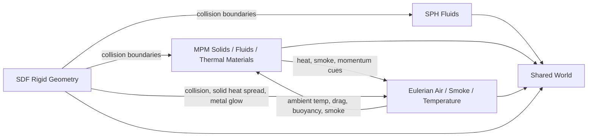
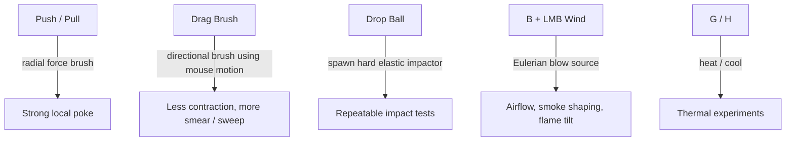

# Noita-Gish Technique Guide

This guide is a working map of what the simulation currently does, which scene or material shows each technique best, and what behavior we should expect when things are working.

## System Map

## Solver Families

### SPH

Use SPH when we want liquid-like motion, splashing, dripping, or codimensional thread behavior.

| Technique | Where to see it | What to expect |
|---|---|---|
| WCSPH pressure | `Water`, `Viscous Goo`, `Light Oil` | Bulk fluid volume preservation, splashy impacts, dam-break motion |
| XSPH smoothing | Most SPH scenes | Reduced particle noise, more coherent blobs |
| Surface tension | `Codim Threads` scene | Drips neck down, bridges form, thin streams reconnect |
| Codimensional SPH | `Codim Threads` scene | Thin 1D-looking filaments instead of every stream collapsing into a fat 2D blob |
| SDF collision | Any scene with walls | Fluids slide, pool, and wrap around rigid boundaries |

### MPM

Use MPM for deformable solids, packed media, fracture, curing, melting, burning, and hybrid solid-fluid materials.

| Technique | Core behavior | Best examples |
|---|---|---|
| Corotated elastic MPM | Shape-holding soft solids | `Soft Jelly`, `Rubber`, `Stiff Elastic` |
| Snow plasticity | Compression and packing history | `Soft Snow`, `Packed Snow`, `Ice Chunks` |
| Thermal softening | Loses stiffness when hot | `Wax`, `Soft Clay`, `Hot Metal` |
| Phase transition | Solid to mush to liquid with latent heat | `Ice`, `Frozen Gel`, `Butter` |
| Irreversible curing | Soft to permanently hard | `Wet Clay`, `Epoxy Resin`, `Ceramic Slip` |
| Fracture / chunking | Damage accumulation and bond loss | `Brittle`, `Tough`, `Terracotta`, `Porcelain` |
| Fiber anisotropy | Grain direction matters | `Fiber`, `Rope`, `Wood`, `Bamboo`, `Bone` |
| Combustion / embers | Heat release, smoke, buoyant ash | `Wood Log`, `Paper`, `Coal`, `Sparkler`, `Hot Embers` |

### Eulerian Air

Use Eulerian air when we want smoke, convection, ambient drag, wind, and temperature transport in the gas.

| Technique | Where to see it | What to expect |
|---|---|---|
| Buoyancy | Fire scenes | Hot smoke rises, embers loft upward |
| Air drag on particles | Light hot debris, flames, ash | Small/hot material responds to flow more than dense rigid chunks |
| Temperature diffusion | Heated chambers and SDF walls | Air warms near sources, spreads, and cools back down |
| Wind injection | `Wind Tunnel`, `Open Oven + Wind`, `Pot Heater + Wind` | Persistent rightward airflow, tilted smoke plumes, pushed flames |

### SDF Rigid Geometry

Use SDF geometry for walls, containers, ramps, furnaces, and conductive metal-like rigid objects.

| Technique | Where to see it | What to expect |
|---|---|---|
| Signed-distance collision | Most scenes | Clean particle-wall collision without rigid body simulation |
| Solid heat spreading | Furnace / oven / pot scenes | Heat stays local at first, diffuses through the wall, then leaks away |
| Solid heat sink / dissipation / leak | `SDF Solids` UI section | We can tune how far wall heat travels and how long it remains |
| Red-hot metal visualization | Heated SDF scenes | Metal glows dark red to orange instead of looking like free flame |

## MPM Material Map

### Structural and fracture materials

| Material / preset | What it is for | Expected behavior |
|---|---|---|
| `Brittle (V/H)` | Direction-sensitive brittle solid | Holds some shape, then cracks sharply; H/V should fail differently |
| `Tough (V)` | Higher crack threshold solid | Resists early collapse better than brittle and keeps chunkier pieces |
| `Glass [experimental]` | Cold brittle glass | Hard when cool, shatters under impact or thermal stress |
| `Tempered Glass [experimental]` | Stronger glass demo | Should keep shape cold, soften only in a high-heat window, then reharden on cooling |
| `Hot Glass [experimental]` | Hot working glass | Starts in the viscous range, deforms slowly, then stiffens again as it cools |
| `Terracotta` / `Porcelain` | Fired brittle ceramics | Cure first, then break into rigid fragments instead of slurry |
| `Bloom Clay [new]` | Curing + internal expansion | Hardens, swells internally, then breaks into petal-like chunks |
| `Kiln Reed [new][experimental]` | New splintering thermal material | Hardens strongly under heat, then self-cracks into fiber-like shards along grain |
| `Puff Clay [new][experimental]` | Gas-swollen fired clay | Cures under heat, inflates from trapped gas, then crumbles into hot chunks |
| `Bread Dough [new][experimental]` | Soft gas-forming matrix | Puffs under heat, sets partway, and tears open when internal pressure wins |
| `Crust Dough [new][experimental]` | Shell-first baking | Outside dries and stiffens into crust while the core keeps inflating and tearing |
| `Steam Bun [new][experimental]` | Springier shell/core baking | Rises rounder than loaf dough, keeps a puffier body, and vents more gently |
| `Glaze Clay [new][experimental]` | Layered pottery blank | Outer shell cures and vitrifies first, glaze skin appears hot, and mismatch cracks can form |
| `Glaze Drip [new][experimental]` | Flowing glaze shell | Outer glaze gets hotter and runnier, so the shell can pool and droop while the core stays ceramic |
| `Quench Steel [new][experimental]` | Thermoelastic metal | Heats soft, expands under restraint, then cools back harder with residual stress |
| `Spring Steel Strip [new][experimental]` | Slender thermoelastic metal | Thin strips heat soft, bend more readily, and recover with stronger cool-set springiness |

### Fiber and wood-like materials

| Material / preset | What to watch | Expected behavior |
|---|---|---|
| `Soft Wood (H)` | Matrix softening and charring | Starts compliant, chars and weakens fast, becomes more limp and fragile |
| `Hard Wood (H)` | Stiff-to-brittle transition | Starts stiffer, keeps structure longer, then becomes more snap-prone after heating |
| `Fiber (V)` | Grain reinforcement | Holds better along fiber than across it; heat should visibly weaken the bundle |
| `Rope` | Heat-weakening anisotropic bundle | Soft even when cool, then loses remaining structure rapidly as fibers char |
| `Bamboo (V)` | Directional split demo | After heating/cure, should split more readily along grain |
| `Bone` | Stiff anisotropic fracture | Heat makes the fracture response more obvious, especially under bending/shear |
| `Carbon Fiber` | Extreme anisotropy | Very strong along grain, weak across grain |

### Thermal, fire, and odd materials

| Material / preset | What to watch | Expected behavior |
|---|---|---|
| `Lamp Oil [new]` | Flammable MPM liquid | Pools like a liquid, ignites, adds smoke, and can burn as a spreading puddle |
| `Intumescent Block [new][experimental]` | Porous heated solid | Starts firm, then softens, swells, and flows in a foamy / sandy way |
| `Firecracker Pellet [new][experimental]` | Pressure-driven rupture | Heats as a shell, pressurizes, vents hot smoke, and bursts into hot fragments |
| `Popping Resin [new][experimental]` | Staged burning shell/core solid | Outside chars first, trapped volatiles build inside, then smoky blister bursts kick outward |
| `Popping Seeds [new][experimental]` | Tiny staged-burn pops | Small kernels toast, smoke, and kick into lots of little pressure pops instead of one large burst |
| `Wood Log`, `Paper`, `Coal` | Burning solids | Ignite, weaken, transfer heat to air, and produce smoke |
| `Sparkler`, `Hot Embers`, `Magnesium` | Ember / spark behavior | Bright hot particles, long glow, upward loft from hot air |

`[new]` marks recent additions. `[experimental]` marks first-pass behaviors that are intentionally exposed early and may still need retuning.

## Interaction Tools

| Tool | Keys | Expected use |
|---|---|---|
| Push | `1` | Quick poke or shove |
| Pull | `2` | Gather material inward |
| Drag Brush | `3` | Sweep material sideways without the strong radial contraction of pull/push |
| Drop Ball | `4` | Spawn a hard elastic test impactor with adjustable radius, stiffness, and weight |
| Draw / Erase wall | `5` / `6` | Sketch or carve rigid SDF geometry |
| Heat / Cool gun | `G` / `H` | Add or remove thermal energy at the cursor |
| Wind brush | `B + LMB` | Inject directional airflow into the Eulerian gas |

## Scene Guide

| Scene | Purpose | What should happen |
|---|---|---|
| `Default` | Mixed baseline sandbox | SPH, MPM, ramps, and obstacles all interact |
| `Thermal Furnace` | Basic hot chamber | Thermal blocks heat and deform in a contained space |
| `Fracture Test` | Impact fracture | Falling stiff body breaks the target pillar |
| `Melting` | Phase field | Cold block melts from the hot plate upward |
| `Dam Break` | SPH benchmark | Water column collapses and hits solids |
| `Stiff Objects` | Shape holding | High-stiffness objects should not immediately pancake |
| `Heat Ramp` | Heat while moving | Objects slide through a thermal gradient and change state while traveling |
| `Fire & Forge` | Burn + harden + quench | Burning fuel, hardening clay, hot particles, and water coexist |
| `Codim Threads` | Thin-fluid showcase | Bridges, drips, and thread-like flow are easiest to inspect here |
| `Wind Tunnel` | Airflow inspection | Smoke and flow should move strongly to the right around obstacles |
| `Open Oven` | Open heated cavity | Hot plume escapes upward while SDF walls glow and conduct |
| `Pot Heater` | Closed heater under open pot | Heat should soak through the rigid lid/walls and affect material above |
| `Open Oven + Wind` | Open furnace under draft | Flame/smoke lean right and chamber heating becomes asymmetric |
| `Pot Heater + Wind` | Pot heating with cross-flow | Pot plume bends right and top material heats unevenly |
| `Glaze Kiln` | Layered pottery firing | Shell-first pottery should cure at the skin, begin to glaze, and crack from shell/core mismatch |
| `Bake Oven` | Crust-versus-core loaf test | `Crust Dough` should crust outside while `Bread Dough` stays more uniformly puffy |
| `Stress Forge` | Thermoelastic stress bar | A long metal bar should soften hot, expand unevenly, then cool back harder and more stress-prone |
| `Reactive Hearth` | Staged burn / blister burst | Reactive resin should char, smoke, build pressure, and push the test lid when it vents |
| `Glaze Rack` | Drippy glaze showcase | `Glaze Drip` should show a hotter runnier shell than `Glaze Clay`, with more pooling and droop |
| `Steam Oven` | Bun-versus-loaf comparison | `Steam Bun` should stay rounder and springier than `Crust Dough` and `Bread Dough` |
| `Seed Roaster` | Small reactive pops | The seed bed should produce many tiny smoky pops and nudge the light lid repeatedly |
| `Crazing Shelf` | Shell/crack comparison rack | `Glaze Clay`, `Crazing Tile`, and `Glaze Drip` should separate cleanly into shell-first, crack-first, and flow-first reads |
| `Pocket Oven` | Flat pocket versus bun | `Pita Pocket` should balloon flatter, `Steam Bun` should puff rounder, and `Crust Loaf` should stay more bread-like |
| `Tempering Bench` | Multi-part thermoelastic demo | The long bar, spring strip, and blade blank should all read different hot-bend / cool-set behaviors |
| `Pressure Pantry` | Side-by-side burst pantry | Gunpowder should kick hardest, pellets should smoke then burst, and the popping tray should tap its lid repeatedly |

## Quick Tabs

The creation menu now has a curated quick-tab strip for the newer heat-focused materials:

- `Kiln & Bake`: curing, puffing, kiln splintering, bloom clay
- `Shell & Core`: glaze shells, crust-forming doughs, buns, pocket breads
- `Metal & Stress`: thermoelastic bars, strips, and tempering blanks
- `Pressure & Pop`: firecracker, gunpowder, popping resin, seeds, and popcorn-like charges

## Quick Expectations Checklist

If the current build is healthy, we should usually see:

- SPH liquids splash and form coherent blobs instead of exploding or vanishing.
- MPM gravity works and hot/cold state changes still update particle colors.
- `Tough` holds its shape better than `Brittle`.
- `Glass` is hard when cool, and `Tempered Glass` only becomes visibly soft in the hotter range.
- `Intumescent Block` swells and loosens into porous flow when heated.
- Fire materials heat the air and create rising smoke.
- Heated SDF walls look red-hot, not like open flame textures painted on stone.
- Wind scenes show clear rightward advection without manual blowing.

## Good Experiments

1. Put `Tempered Glass`, `Glass`, and `Porcelain` side by side in `Open Oven`.
2. Drop the hard ball onto `Kiln Reed`, `Bamboo`, and `Bone` before and after heating.
3. Use `Pot Heater` with `Lamp Oil` in the pot and compare it against `Intumescent Block`.
4. Turn on `Air Vis -> Velocity` or `Temperature` in the wind scenes to separate thermal effects from flow effects.

## Missing Techniques Roadmap

The current sim already covers a lot of heat-driven behavior:

- thermal softening
- reversible hot-glass style softening / re-hardening
- irreversible curing
- brittle fracture and chunk retention
- porosity / expansion style materials
- combustion, embers, smoke, and buoyant hot gas
- anisotropy and fiber-guided fracture

What is still missing for the more advanced heat-first material goals is mostly *internal state structure*, especially stress history, layered surfaces, gas generation, and multi-phase composition.

### 1. Metal heating / cooling / tension / hardening

Missing techniques:

- thermoelastic stress accumulation: material should build internal tension/compression when one region heats or cools faster than another
- thermal expansion with restrained boundaries: currently we fake volume preference in some materials, but not true expansion-constrained stress
- plasticity + annealing split: hot metal should often become softer while heating, then potentially stronger or more brittle after cooling depending on treatment
- transformation / quench hardening field: a state variable for "microstructure phase" would let fast cooling produce harder regions than slow cooling

What this would enable:

- bent or cracked bars from uneven heating
- quenching that changes future stiffness instead of only current temperature
- forged-looking behavior where hot metal moves easily, then sets differently after cooling

### 2. Pottery and glaze

Missing techniques:

- layered material model: a thin surface shell that evolves differently from the interior
- sintering / vitrification gradient: outer region cures first, inner region later
- glaze phase: a surface-only phase transition with smoother, more fluid flow than the clay body
- moisture / burnout field: early firing usually drives off water and volatiles before final ceramic hardening

What this would enable:

- a hard ceramic body with a glossy or flowing outer glaze skin
- cracking from outer-shell shrink / inner-core mismatch
- more authentic kiln behavior where the outside matures before the center

### 3. Baking / bread / fluffy porous growth

Missing techniques:

- gas generation source term: yeast / steam / chemical reaction producing internal pressure
- viscoelastic matrix: dough should stretch and relax, not behave like a simple elastic solid
- crust formation layer: outside should dry / harden while inside remains soft and expanding
- heat + moisture coupling: steam and moisture loss matter a lot for baking-like behavior

What this would enable:

- rising bread
- bubbling, blistering, and uneven pore structure
- dense-underbaked versus fluffy-well-risen internal texture

### 4. More interesting burning behavior

Missing techniques:

- pressure-driven rupture / burst events: for firecrackers, popping seeds, bursting resin pockets
- oxidizer-limited combustion: burning should depend more on local airflow and enclosure conditions
- fragment ejection: explosions should spawn hot shards / sparks / burning debris
- staged burn chemistry: charring, pyrolysis gas, flame phase, ash phase

What this would enable:

- popping and explosive reactive materials
- different fire behavior in open wind versus sealed containers
- more dramatic transitions than "weaken and float upward"

### 5. Compound materials and microstructure

Missing techniques:

- multi-field materials: separate binder, fiber, pore, moisture, gas, glaze, or grain fields
- shell-core composites: surface and interior behave differently
- packed inclusions / aggregates: particles with embedded hard grains or void nucleation sites
- microstructure orientation fields beyond a single fiber vector

What this would enable:

- concrete-like materials
- laminated or coated materials
- bone / bamboo / wood with more distinct directional failure modes
- materials that react differently depending on how they were made, heated, or cooled

## Best Next Additions

If the goal is "heating and cooling are the most interesting part", the highest-value next techniques are probably:

1. Thermoelastic stress plus constrained thermal expansion.
   This now has a first-pass prototype in `Quench Steel [new][experimental]`, and it is still the key foundation for convincing metal and more believable ceramic cracking.
2. Layered surface/interior state.
   This now has first-pass prototypes in `Glaze Clay [new][experimental]` and `Crust Dough [new][experimental]`, and it unlocks glaze, crust, shell-core fracture, and many kiln / baking behaviors.
3. Gas-generation field coupled to a soft matrix.
   This now has a first-pass prototype in `Bread Dough [new][experimental]` and `Puff Clay [new][experimental]`, and it unlocks bread, foaming, puffing, bubbling, and pressure-driven bursting.
4. Reactive burst / fragmentation events.
   This now has first-pass prototypes in `Firecracker Pellet [new][experimental]` and `Popping Resin [new][experimental]`, and makes burning materials much more surprising and expressive.
5. Multi-phase material state fields.
   This is the long-term route to microstructured and compound materials.

## One Likely Reason Glass Still Collapses

The current glass model is still closer to a hot viscoelastic body than a brittle solid with strong residual network memory. It is probably still missing at least one of:

- a stronger cold-state shear modulus floor
- slower deformation-memory reset while hot
- explicit thermal stress instead of only stiffness blending
- a better distinction between "soft enough to sag" and "liquid enough to flow"

So the next glass-specific improvement is probably not a brand new material, but a better *glass transition / annealing / thermal stress* model.
